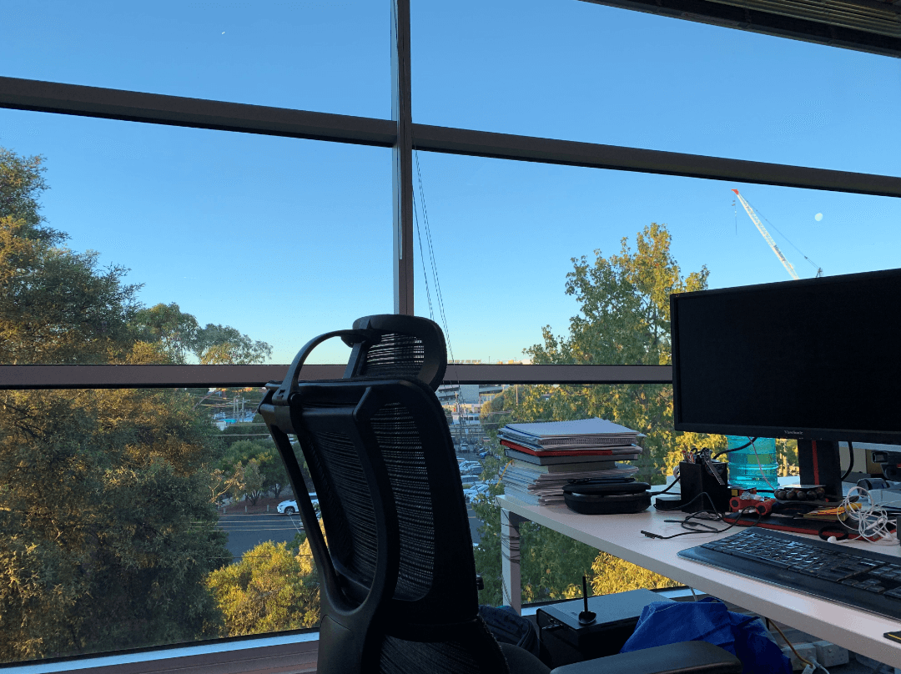

## 61 Financial 招聘后端/全栈工程师（2+ years，坐标墨尔本，提供雇主担保）

> 可提供 [TSS 482 Medium-term 工签](https://immi.homeaffairs.gov.au/visas/getting-a-visa/visa-listing/temporary-skill-shortage-482/medium-term-stream)（可转 [186 永居](https://immi.homeaffairs.gov.au/visas/getting-a-visa/visa-listing/employer-nomination-scheme-186/temporary-residence-transition-stream)），当前下签时间大概 [1 ~ 2 个月](https://immi.homeaffairs.gov.au/visas/getting-a-visa/visa-processing-times/global-visa-processing-times)，要求下签后尽快到岗  
> （注：有关签证的*基本信息*，请自行查阅极尽详细的[澳洲移民局官网](https://immi.homeaffairs.gov.au)，而不是直接问我们哈）

这是我们的官网 https://61financial.com.au  
创业近两年以来，目前已成为访问量最高的澳股中文资讯平台之一  
我们是该领域的开拓者，立足华人群体，扩展全球，前景相当广阔  
希望我们可以借鉴中国的互联网模式，在澳洲一起开辟出新的天地

虽然我们在土澳，但技术栈可不能跟着土，必须得跟得上业内潮流  
目前后端使用 Python / Node.js / PHP，前端则是 React / Vue（均 SSR 保证 SEO）  
全站基于 AWS，代码托管/项目管理/持续集成基于 Github 工作流

我们希望你具备以下基本条件：
* 两年以上后端/全栈开发经验（Go / Python / Java）
* 掌握主流 Web 服务器、数据库、缓存的使用与调优
* 具备一定的系统架构能力，熟悉各项云服务的管理、部署
* 良好的英语水平（需例证），以便与我们的数据提供商谈笑风生

加分项：
* 金融行业从业者
* 秉承最佳实践的开发理念
* 具备分布式、容器化部署等生产经验
* 熟悉微服务，对业务的拆分与整合具备丰富的实战经验
* 熟悉运维相关，对性能优化与 Web 安全有较为深入的认识
* 若有，建议附上你的博客与 Github（talk is cheap, show me your code）

你的同事有八大的博士，微信团队的 GG，还有来自台湾的技术控  
团队年轻，管理扁平，关系简单，真的可以做到安安静静地写代码

公司位于“宇宙中心” Glen Waverley 的 Station 附近，地理位置极其优越  
朝九晚五（再也不用担心 996 甚至 9127），咖啡零食水果样样有

入职可选配 Mac 或 PC  
薪资依能力定，相信不会让你失望

有意者请发送简历到 aHJANjFmaW5hbmNpYWwuY29tLmF1 (base64)

> 备注：由于投递简历的候选人很多，我们可能无法一一回复，恳请谅解

